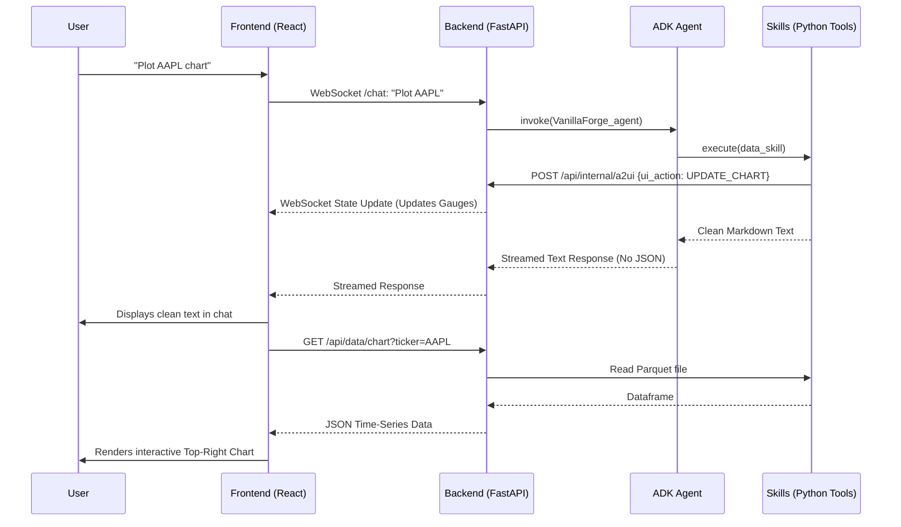

# VanillaForge Agent

VanillaForge is a high-precision financial analysis agent built on Google's **Agent Development Kit (ADK) 2.0**. Originally a generic options derivative conversational assistant, it has been heavily customized following the advanced "Agent Skills" from Google ADK architecture, specifically leveraging **Progressive Disclosure** and **Shift Intelligence Left** to minimize token usage, resolve issues before execution, and remain highly efficient and secure. 
In addition, it utilizes a dedicated local MCP server as a persistent long-term memory to log derivative trade strategies on demand, and track sentiment analysis over time for any equity of your choosing.

## Architecture Overview

The agent is designed as a single, deterministic orchestration engine (`VanillaForge_agent`) locked at `temperature=0.1`. Instead of a complex, brittle routing graph, the agent dynamically discovers and loads independent tools from the `skills/` directory at runtime only when needed, in order to save token usage and avoid context memory rot (hallucination).

```text
                       [START]
                          │
                 [VanillaForge_agent]
                /         │          \
      (Dynamic Skills)    │     (MCP Integration)
            /             │             \
           ▼              ▼              ▼
   [pricing_skill]  [data_skill] ...  [memory_mcp_server]
           │              │              │
           ▼              ▼              │ (Direct ADK integration)
[skill_loader.py (SkillToolset)]         │
[Injects __agent_instructions__]         │
           │              │              │
            \             │             /
             ▼            ▼            ▼
                 [VanillaForge_agent]
                          │
                    (User Resumes)
```

### The `SkillToolset` Loader (`app/skill_loader.py`)
At the core of the architecture is the automated `skill_loader.py`. 
When the agent starts, it scans the `skills/` directory and parses the lightweight YAML metadata from each `SKILL.md` file. It then automatically intercepts tool execution to inject the heavy Markdown instructions (`__agent_instructions__`) into the payload *only when the skill is actually used*. This prevents "Context Rot" and keeps the agent fast and cheap.

## Available Skills

The `VanillaForge_agent` currently possesses 5 core capabilities:

1. **`documentation_skill`**: **Soaks up educational derivatives textbooks to teach you financial theory.** It performs RAG over a local ChromaDB to answer complex educational options theory questions without hallucinating. Includes also a built-in ingestion tool (`scripts/ingest_pdfs.py`) to easily drop new PDFs into `Documents_options/` and instantly expand the agent's knowledge base.
2. **`company_information_skill`**: **Provides basic company profile and financials.** It scrapes and retrieves specific fundamental metadata about a publicly traded company.
3. **`pricing_skill`**: **Calculates the fair price and risk metrics of any strategy based on European vanilla options.** It acts as a Black-Scholes-Merton (BSM) calculator for European options. If the user omits inputs, an internal sub-agent seamlessly fetches the live Spot Price, Implied Volatility, and Dividend Yield from Google Search before computing the option premium and Greeks.
4. **`data_skill`**: **Downloads historical market data and draws pricing charts.** It uses `yfinance` to download market data, persists massive datasets locally as high-performance `.parquet` and `.csv` files, and generates `seaborn` visualizations.
5. **`news_sentiment_skill`**: **Reads the news to tell you if the market is bullish or bearish on a stock.** It retrieves the top 10 most recent news articles for an equity and performs a rigid semantic sentiment analysis on each, returning a structured 0-100 score and thematic breakdown.

## MCP Servers

Model Context Protocol (MCP) servers run independently and provide the agent with standardized external memory and capabilities:

1. **`memory_trade_sentiment`**: **Acts as the agent's persistent long-term memory for trade strategies and equity market sentiment.** It runs a local SQLite database (`vanillaforge_memory.db`) via the FastMCP protocol, allowing the agent to invisibly log theoretical derivatives trades (including implied volatility) and track historical market sentiment for equities you have analyzed and chosen to log.
    * *Example:* In a week's time, you can ask: *"How did that CVX option I priced last Tuesday perform?"*
    * *Example:* Over a few weeks, the agent could query the MCP and tell you: *"CVX sentiment was extremely bullish (85) two weeks ago, but the local database shows it has been steadily declining to 45 today. The trend is reversing."* This effectively turns a stateless agent into a persistent, analytical memory bank.


---

## Directory Structure

*   **`app/agent.py`**: The central orchestrator Agent configuration and persona.
*   **`app/skill_loader.py`**: The automated Progressive Disclosure framework loader.
*   **`skills/`**: Contains the decoupled skill logic. Every skill has its own `SKILL.md` (metadata and instructions) and a `scripts/` folder containing the Python tools.
*   **`mcp_servers/`**: Contains the local Model Context Protocol (MCP) servers, such as the persistent SQLite memory server for derivatives trades and equity sentiment analysis journaling.
*   **`scripts/ingest_pdfs.py`**: Pipeline script to extract, chunk, and embed new PDFs into the local ChromaDB database.
*   **`Documents_options/`**: Drop folder for new PDF textbooks and references.
*   **`evals/eval_cases.json`**: The test suite used for Evaluation-Driven Development (EDD) of all skills.
*   **`tests/`**: Pytest assertions covering the agent flow and skill capabilities.

---

## Standalone Dashboard Architecture

The VanillaForge Dashboard provides an **Agent-to-User Interface (A2UI)** financial terminal while **keeping the original ADK Web fully functional**. It converts a stateless CLI agent into a fully reactive, 6-panel financial terminal using FastAPI and React.

### 1. Dashboard Layout & Component Architecture
The frontend uses a CSS Grid layout mimicking modern financial terminals (e.g., Bloomberg).

```text
+-------------------------+-----------------------------------------+
| [Top-Left]              | [Top-Right]                             |
| Main Chat               | Historical Market Data Chart            |
| (Websocket to Agent)    | (ECharts; Time-Series OHLC plotting)    |
+-------------------------+-----------------------------------------+
| [Middle-Left]           | [Middle-Right]                          |
| Option Pricer           | Company Information                     |
| (Inputs, Greeks, &      | (Explicit financial metrics,            |
| BSM theoretical price)  | valuation, business segments)           |
+-------------------------+-----------------------------------------+
| [Bottom-Left]           | [Bottom-Right]                          |
| News Sentiment          | MCP Trade & Sentiment Journal           |
| (Recent Headlines/Score)| (Dropdown: Trade / Sentiment tables)    |
+-------------------------+-----------------------------------------+
```

### 2. The Internal "A2UI" Webhook Protocol
To achieve Progressive Disclosure without polluting the chat interface with raw JSON, the architecture relies on **Tool-emitted Internal Webhooks**. Instead of forcing the LLM to output UI commands, the underlying Python scripts (`fetch_profile`, `news_fetcher`, etc.) intercept the data internally. They fire a behind-the-scenes HTTP request directly to the FastAPI backend's internal endpoint (`/api/internal/a2ui`) to sync the React dashboard, and then strip the JSON away to return *only* beautiful, clean text to the Main Agent. This ensures a pristine chat experience in ADK Web/CLI while keeping the dashboard reactive in real-time.

| Skill Name | Dashboard Panel | A2UI Data Flow |
| :--- | :--- | :--- |
| `VanillaForge_agent` | **Top-Left (Chat)** | Streams clean text directly to the chat log (No JSON). |
| `data_skill` | **Top-Right (Chart)** | Tool POSTs webhook. Frontend fetches JSON from `/api/data/chart` and plots interactive graph. |
| `pricing_skill` | **Middle-Left (Pricer)** | Tool POSTs BSM outputs via webhook. Frontend renders Greeks gauges/metrics. |
| `company_information_skill`| **Middle-Right (Info)** | Tool POSTs company metadata via webhook. Frontend updates profile cards. |
| `news_sentiment_skill` | **Bottom-Left (News)** | Tool POSTs sentiment score and headlines via webhook. Frontend updates sentiment dial. |
| `memory_trade_sentiment` | **Bottom-Right (Journal)**| Frontend polls `/api/mcp/journal` directly to populate DataTables via MCP stdio. |

### 3. Data Flow Diagram
The backend (FastAPI) acts as a lightweight wrapper that orchestrates the streaming LLM response and handles internal UI event webhooks triggered by the tools.



---

## Getting Started

### 1. Prerequisites
Ensure you have `uv` installed. If not, follow the [uv installation guide](https://docs.astral.sh/uv/getting-started/installation/).

Install `google-agents-cli` (**Windows / macOS / Linux**):
```bash
uv tool install google-agents-cli
```

### 2. Configure Local Authentication
Duplicate the `.env_example` template:

**Windows:**
```bash
copy .env_example .env
```
**macOS/Linux:**
```bash
cp .env_example .env
```

Set your `GEMINI_API_KEY` in the `.env` file to authenticate with Google AI Studio.

### 3. Install Dependencies
Run the install command to sync package dependencies (**Windows / macOS / Linux**):
```bash
agents-cli install
```

### 4. Build the Local Database
Before running the agent, you need to ingest the options PDFs into the local Chroma vector database. Run the following command (**Windows / macOS / Linux**):
```bash
uv run python scripts/ingest_pdfs.py
```

---

## Running the Agent

### Command Line Smoke Tests
Run a quick educational test query (**Windows / macOS / Linux**):
```bash
agents-cli run "What is a call option?"
```

Test the advanced CVX pricing calculation (with automated dividend yield retrieval) (**Windows / macOS / Linux**):
```bash
agents-cli run "Price a 1-year call option on CVX with a strike of 150."
```

### Interactive Web Playground
Launch the local web-based playground to chat with the agent. 

**Windows:**
```bash
uv run adk web .
```

**macOS/Linux:**
```bash
agents-cli playground
```

Once started, the terminal will print the exact local URL. Typically, you can open your browser and navigate to:
[http://127.0.0.1:8080/dev-ui/?app=app](http://127.0.0.1:8080/dev-ui/?app=app)
*(Note: If port 8080 is already in use on your machine, the terminal output will provide the alternative port number).*

### Standalone Local Web Dashboard
To launch the custom interactive VanillaForge local web dashboard, you will need to start both the backend API and the frontend UI in two separate terminals. These commands are the same for all platforms (**Windows / macOS / Linux**).

**Terminal 1 (Backend API):**
```bash
uv run uvicorn dashboard_backend.main:app --host 0.0.0.0 --port 8000 --reload
```

**Terminal 2 (Frontend UI):**
```bash
cd dashboard_frontend
npm install
npm run dev
```

Then open your browser and navigate to the provided local URL. For example **[http://localhost:5173](http://localhost:5173)** to access the dashboard.
